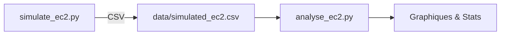

# Projet **FinOps & GreenOps** : Simulation et Analyse d’Instances EC2
---

## 🎯 Objectif  
Simuler des instances Amazon EC2 (coût, énergie, empreinte carbone) puis analyser ces données afin de traiter les volets **FinOps** (optimisation des coûts) et **GreenOps** (impact écologique) sur AWS.

## 🏗️ Architecture  

| Script | Rôle | Principales options CLI |
|--------|------|-------------------------|
| **simulate_ec2.py** | Génère un jeu de données simulé et l’exporte en CSV.<br/>– *Interactif *: questions si aucun argument.<br/>– *Automatisé *: options ci‑dessous. | `-n/--num‑instances` : nombre d’instances (def 50)  <br>`-o/--output` : CSV de sortie (def `data/simulated_ec2.csv`)  <br>`-c/--co2‑price` : prix CO₂ $/kg (def 0.08) |
| **analyse_ec2.py** | Lit le CSV, calcule des stats et produit des graphiques. | `-i/--input` : CSV d’entrée (def `data/simulated_ec2.csv`)  <br>`-d/--outdir` : dossier des graphes (def `plots`)  <br>`--no‑display` : n’affiche pas les figures (headless) |

### Diagramme


## 🚀 Prise en main

### Prérequis  
* Python 3.8 +  
* Modules : `pandas`, `matplotlib`, `numpy`

```bash
pip install -r requirements.txt
```

### 1 | Générer des données  

```bash
# Mode interactif (questions)  
python simulate_ec2.py

# 100 instances, CO₂ à 0.10 $/kg, CSV custom  
python simulate_ec2.py -n 100 -c 0.10 -o results/aws.csv
```

### 2 | Analyser & visualiser  

```bash
# Mode interactif  
python analyse_ec2.py

# CI/CD sans affichage  
python analyse_ec2.py -i results/aws.csv -d reports --no-display
```
Les graphiques PNG sont placés dans le dossier choisi (`plots/` par défaut).

## 📊 Visualisations générées  
* **Scatter** : coût ↔ CO₂ ; coût ↔ coût carbone  
* **Bar Chart** : coût moyen ↔ CO₂ moyen par région  
* **Heatmap** : coût carbone selon région × modèle de pricing  
* **Boxplot** : distribution des coûts par région  

## 📋 Idées d’amélioration
* Export Excel/Parquet  
* Support d’autres clouds (GCP, Azure)  

## 🤝 Contribuer  
1. Fork → branche → PR  
2. Conventions : black, isort  
3. Mettre à jour la doc si nécessaire 😃  

## 📄 Licence  
MIT — utilisation et modification libres.