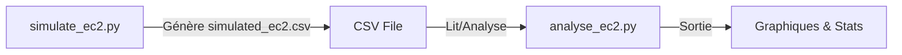

# Projet FinOps & GreenOps : Simulation et Analyse d'Instances EC2

## 🎯 Objectif du Projet

Ce projet a pour but de **simuler** des instances Amazon EC2 (coût, consommation énergétique, empreinte carbone) et de **les analyser** à l'aide de scripts Python. L'idée est d'aborder les **aspects FinOps** (optimisation des coûts) et **GreenOps** (impact écologique) dans un contexte Cloud AWS.

## 🏗️ Architecture du Projet

Le projet se décompose en **deux scripts** principaux :

1. **simulate_ec2.py** :  
   - Gère la **génération** de données simulées (type d'instance, région, modèle de pricing, charge CPU, etc.).  
   - Calcule le **coût** et l'**empreinte carbone** (via un facteur d'émission et un coût CO₂ fictif).  
   - Exporte les données dans un **fichier CSV** (par défaut `simulated_ec2.csv`).

2. **analyse_ec2.py** :  
   - Lit le fichier CSV généré par `simulate_ec2.py`.  
   - Affiche des **statistiques** agrégées (coût moyen, CO₂ moyen).  
   - Génère plusieurs **visualisations** (scatter plots, bar charts, heatmaps, boxplots) pour illustrer les coûts et l'empreinte carbone par région, type d'instance ou modèle de pricing.

### Diagramme Simplifié



## 🚀 Comment Démarrer

### Prérequis

- Python 3.x
- Bibliothèques Python :
  - pandas
  - matplotlib
  - éventuellement numpy pour certaines opérations

### Installation

1. Cloner ou copier ce dépôt.
2. Installer les dépendances (pandas, matplotlib, etc.) :

```bash
pip install pandas matplotlib numpy
```

### Étapes

1. Exécuter simulate_ec2.py pour générer le fichier simulated_ec2.csv.

```bash
python simulate_ec2.py
```

Un message ✅ Données simulées exportées dans simulated_ec2.csv s'affichera.

2. Exécuter analyse_ec2.py pour lancer l'analyse et la visualisation :

```bash
python analyse_ec2.py
```

Tu verras dans le terminal :
- Un aperçu des statistiques (coût moyen, émissions moyennes, etc.)
- Plusieurs fenêtres graphiques Matplotlib (scatter, bar chart, boxplot...), ainsi que des fichiers .png dans le dossier plots/.

## ⚙️ Détails Techniques

### 1. Script simulate_ec2.py

Ce script :

- Définit plusieurs dictionnaires :
  - instance_types (coût horaire de base)
  - region_emissions (facteur d'émission CO₂ selon la région)
  - pricing_models (multiplicateurs de coût : on_demand, reserved, spot)
  - base_power_map (puissance moyenne par type d'instance)

- La fonction generate_instances(n=10) :
  - Choisit aléatoirement un type d'instance, une région, un pricing model, une charge CPU.
  - Calcule le coût total : (coût horaire * uptime_hours).
  - Calcule l'énergie consommée : (puissance_en_Watts * uptime_hours / 1000).
  - Calcule l'empreinte carbone : (kWh * facteur d'émission), puis transforme en kg.
  - Calcule le coût carbone (ex: 0.08 $/kgCO₂).
  - Retourne une liste de dictionnaires contenant toutes ces infos.

- La fonction export_to_csv() enregistre tout dans un fichier CSV.

### 2. Script analyse_ec2.py

Ce script :

- Charge le CSV et vérifie la présence de co2_cost.
- Affiche des statistiques (count, mean, etc.) groupées par pricing_model.
- Génére plusieurs graphiques :
  - Scatter : Coût vs CO₂, Coût vs Coût carbone
  - Bar Chart : Coût moyen vs CO₂ moyen par région
  - Heatmap : co2_cost moyen par (region, pricing_model)
  - Boxplot : Distribution du coût total par région

Les graphiques sont enregistrés dans le dossier plots/ et affichés à l'écran.

## 📊 Visualisations Principales

### Scatter Plot (Coût vs Émissions)
Permet de voir la dispersion des instances, colorées par région et changées de forme selon le pricing model.

### Scatter Plot (Coût vs Coût carbone)
Compare le coût AWS et le coût carbone. Permet de visualiser si certaines instances sont "bon marché" côté AWS mais très coûteuses écologiquement.

### Bar Chart (Coût moyen vs CO₂ moyen) par Région
Montre rapidement quelle région est la plus chère ou la plus émettrice.

### Heatmap (région vs pricing_model)
Permet de voir le coût carbone moyen selon la combinaison (region, pricing_model).

### Boxplot (coût total par région)
Affiche la variabilité et les outliers de chaque région.

## 🎨 Exemple d'Output

- plot_cost_vs_co2.png
- plot_cost_vs_co2cost.png
- bar_cost_co2_by_region.png
- heatmap_co2_cost.png
- boxplot_cost_by_region.png

(Note : ces captures sont d'exemples. Il faut évidemment qu'elles existent dans ton répertoire plots/.)

## 📋 Points d'Amélioration

- Check issues

## 🤝 Contribuer

- Fork le repo et ouvre une pull request si tu améliores le simulateur ou l'analyse.
- Ajouter des tests unitaires (ex: pytest) pour valider que les formules de coût/CO₂ soient correctes.

## 📄 Licence

Projet open-source (MIT, Apache ou autre licence selon tes préférences).

---
