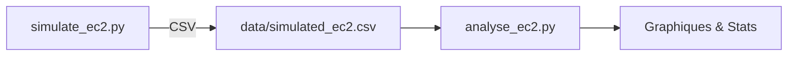

# Projet **FinOps & GreenOps** : Simulation et Analyse d'Instances EC2

## 🎯 Objectif
Simuler des instances Amazon EC2 (coût, énergie, empreinte carbone) puis analyser ces données afin d’aborder les volets **FinOps** (optimisation des coûts) et **GreenOps** (impact écologique) sur AWS.

---
## 🏗️ Architecture
| Script | Rôle | Principales options CLI |
|--------|------|-------------------------|
| **simulate_ec2.py** | Génère un jeu de données simulé et l’exporte en CSV. | `-n/--num-instances` : nombre d’instances (def 50)  \ `-o/--output` : fichier CSV de sortie (def `data/simulated_ec2.csv`)  \ `-c/--co2-price` : prix CO₂ en $/kg (def 0.08) |
| **analyse_ec2.py** | Lit le CSV, calcule des stats et produit des graphiques. | `-i/--input` : CSV d’entrée (def `data/simulated_ec2.csv`)  \ `-d/--outdir` : dossier de sortie des graphes (def `plots`)  \ `--no-display` : n’affiche pas les figures (headless) |

### Diagramme


---
## 🚀 Prise en main

### Prérequis
* Python 3.8 +
* Dépendances : `pandas`, `matplotlib`, `numpy`

```bash
pip install -r requirements.txt
```

### 1 | Générer des données
```bash
# 50 instances, fichier par défaut\python simulate_ec2.py

# 100 instances, CO₂ à 0.10 $/kg, CSV custom\python simulate_ec2.py -n 100 -c 0.10 -o results/aws.csv
```

### 2 | Analyser & visualiser
```bash
# Mode interactif\python analyse_ec2.py -i results/aws.csv -d reports

# Mode CI/CD sans affichage\python analyse_ec2.py --no-display
```
Les graphiques PNG seront placés dans le dossier choisi (par défaut `plots/`).

---
## 📊 Visualisations générées
* **Scatter** : coût ↔ CO₂ ; coût ↔ coût carbone
* **Bar Chart** : coût moyen ↔ CO₂ moyen par région
* **Heatmap** : coût carbone selon région × modèle de pricing
* **Boxplot** : distribution des coûts par région

---
## 📋 Améliorations possibles
* Ajouter des tests (pytest)
* Intégrer un export Excel/Parquet
* Supporter d’autres clouds (GCP, Azure)

---
## 🤝 Contribuer
1. Fork → feature branch → PR
2. Suivre les conventions de code (black, isort)
3. Mettre à jour cette documentation au besoin 😃

---
## 📄 Licence
MIT — libre d’utilisation et de modification.

